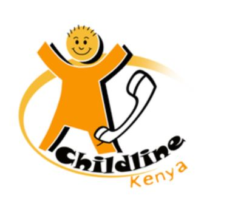

# Call Volume Prediction

Childline Kenya works in partnership with the Government to STOP child abuse and provide a safe environment for all children. They offer the only nationwide helpline service dedicated to children that runs 24X7 toll free, and is accessible by simply dialing 116.

The objective of this project is to create a forecast model to predict the number of incoming calls that Childline Kenya will receive per hour per day. Forecasting will help Childline manage its resources and staff their call center more efficiently, enabling them to better serve as many children as possible.

[Click to view the project](https://nbviewer.jupyter.org/github/rsaadiq/call_volume_prediction/blob/master/call_volume_prediction.ipynb)
